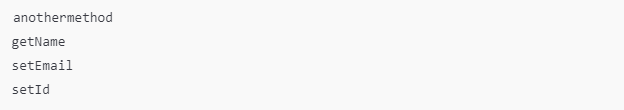

# Reflexão em Java

O desafio de código apresentado é baseado no uso de Reflexão em Java (Java Reflection), uma funcionalidade avançada que permite inspecionar e manipular classes, métodos, atributos e outros elementos de um programa em tempo de execução. A seguir, explico o que é esperado no desafio:

### Contexto: Reflexão em Java
A reflexão permite que você obtenha informações sobre os elementos de uma classe durante a execução do programa, mesmo que esses elementos não sejam acessíveis diretamente pelo código. No desafio, você vai usar reflexão para listar todos os métodos da classe Student em ordem alfabética.

### Objetivo do Desafio
Você precisa completar o código na classe Solution para:
1. Usar a API de Reflexão do Java.
2. Obter todos os métodos da classe Student, incluindo os públicos e herdados.
3. Ordenar os métodos alfabeticamente pelo nome.
4. Imprimir os nomes desses métodos no formato indicado.

### Detalhes Técnicos
1. Classe Student:
   * É uma classe que possui atributos privados (name, id, email) e métodos públicos (getName, setId, setEmail, entre outros).
   * O desafio não exige que você modifique essa classe, apenas trabalhe com ela usando a classe Solution.
  
2. Classe Solution:
   * É a classe onde você escreverá o código para resolver o problema. O foco será usar a classe Class do Java e seus métodos de reflexão, como getDeclaredMethods() ou getMethods().
  
3. Saída esperada:
   * Os nomes dos métodos da classe Student, impressos em ordem alfabética. Por exemplo:
Copiar código\

4. Sem Entrada/Saída Padrão:
   * Não há entrada de dados (como Scanner) ou saída final visível. O código será avaliado pelo comportamento.

